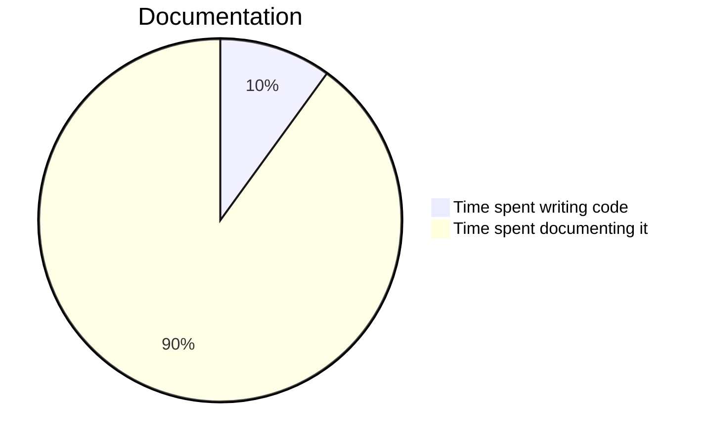

## **Preface**

**IncluDoc** is an Open Source project of **VivaRado**.

<div markdown='1' class="header_logo">


</div>

<div markdown='1' class="sidebar">

### **Contents**

1.  **Preface**
1.  **Introduction**
    1.  **Profile**
    1.  **Project Overview**
1.  **Design**
1.  **Installation**
1.  **Usage**
    1.  **Parameters**
    1.  **Includes**
    1.  **Ignores**
1.  **Vendors**
1.  **Templates**
    1.  **Structure**
    1.  **Multilingual**

### Glossary

1.  **Glossary**

### Reference

1.  **Reference**

</div>
 
##  **Introduction**

**IncluDoc** inclusive and multilingual Markdown documentation!

#### Contributors:

*  VivaRado support@vivarado.com
*  Andreas Kalpakidis
*  Madina Akhmatova


---

### **Introduction / Profile**


*  Company: VivaRado LLP
*  Designer: Andreas Kalpakidis
*  Management: Madina Akhmatova

---


### **Introduction / Project Overview**

*   Project Name: IncluDoc
*   Code Name: IncDoc
*   Proposal Date: 28/05/2025

---


### **Design**

IncluDoc gathers Markdown files, handles include statements and generates a main README.md and/or a multilingual README.html with a user interface.

A file can have alternatives and you can choose which gets included and compiled.

The user interface and SVG on the documents are designed to work with ```prefers-color-scheme: dark``` and react to dark and light mode.


---

### **Installation**

Prerequisites:

* The compilation of the **Markdown** files relies on **Python** and libraries **Markdown2** and **lxml**. 
* The HTML user interface uses **emphase** to highlight code elements, already included in the ```assets/vendors```, you might need to include some language files a the footer of ```Lib/html_template.py``` in case you need to render more languages.


#### Install Python Requirements:

To install python requirements from the ```requirements.txt```, run this command:

```pip install -r Lib/requirements.txt```

or install each dependency package manually:

* lxml
* Markdown2


---

### **Usage**

Prepare and organise your files into directories within ```/lang``` and compile with parameters bellow.

---

### **Usage / Parameters**


Pass the parameters during python file execution.

```
python3 './_README/gen_readme.py' --format 'html,md' --alter 'M0'
```

---

#### Parameter Overview

A description of each parameter:

<br>

**--format** [ String ]
> 
> Provide the generated format string, supported formats: ```'html'``` ```'md'``` 

<br>

**--alter** [ String ]
> 
> Provide the alternative files to look for inclusion, suggested structure is a letter and a number like ```A0, A1 ...```

---

### **Usage / Includes**


You can include MD files from within MD files by providing an **inline** MarkDown **code block** with special parameters. Grave accents ` are enclosed (```) in the examples bellow, we need them disclosed in the actual markdown.

```
(```){include=partials/profile_project.md}(```)
```

To provide an alternative for the include:

```
(```){include=partials/profile_project.md,M0}(```)
```

The alternative priority is described here: ```Templates / Structure```.

---

### **Usage / Ignores**

You can create .gitignore and .npmignore to avoid publishing any uncompiled markdown files. For example:

```
# .gitignore
_README/__pycache__/
_README/addons/
_README/lang/
_README/Lib/
_README/*.py
_README/*.txt
_README/version
_README/*.html
_README/*.sh
_README/assets/css/
_README/assets/js/
_README/assets/vendor/
```

---

### **Vendors**

Here are examples of some popular vendors in this readme.

---

#### MermaidJS

MermaidJS for various graphs and schedules.

<br>



---

#### FlowchartJS

FlowchartJS for flowcharts.

<br>

```flowchart
st=>start: Start:>http://www.vivarado.com[blank]
e=>end:>http://www.vivarado.com
op1=>operation: My Operation
sub1=>subroutine: My Subroutine
cond=>condition: Yes
or No?:>http://www.vivarado.com
io=>inputoutput: catch something...
para=>parallel: parallel tasks
in=>input: some in
out=>output: some out

st->op1->cond
cond(yes)->io->e
cond(no)->para
para(path1, bottom)->sub1(right)->op1
para(path2, top)->op1
para(path3, right)->in->out->e
```


---

### **Templates**

Templating is versatile and easy, allows for custom structures and includes. We hope to add some templates in the near future.

---

### **Templates / Structure**

It is important to maintain a couple of things in order to be able to use IncluDoc.


#### Hierarchy:

The interactive user interface uses the H3 wrapped category titles, in combination with the contents hierarchy, for navigation. That is why you should match what you have in your contents file (that will end up as the sidebar) and your content header titles.

e.g.:

Assuming this is in your **contents.md**:

```
1.  **Introduction**
    1.  **Profile**
    	1.  **Contributors**
    1.  **Project Overview**
```

Your **document.md** should have these headers:


```plaintext
**Introduction**

**Introduction / Profile**

**Introduction / Profile / Contributors**

**Introduction / Project Overview**
```

#### Priority:

The files in each language directory within ```/lang```, and no deeper. Are included in order of enumeration.

```
000_preface
001_contents
002_document
003_footer
```

#### Alternatives:

During generation, you can input the alternative you prefer to be included, using the parameter ```--a``` or ```--alter```. This will allow for alternative versions of files to be selected for compilation. The selection priority is to select the file requested with the ```--alter``` parameter, if that file does not exist, then select the default version of that file.

e.g.:

Assuming your ```--alter``` parameter is ```M1```, here is the result on your files:

```
000_M1_preface:
	> would be selected because it is a requested alternative.

000_preface:
	> would be ignored because it is the default and there is an alternative found.

001_M0_contents:
	> would be ignored because it is a different alternative.

001_contents:
	> would be selected because it is the default and the alternative requested was not found.
```

---

### **Templates / Multilingual**

Generate multilingual documentation, with a user interface.


#### Multilingual Directories:

IncluDoc will gather every language directory within ```/lang``` compile and combine that into separate MD documents, placed in those directories as ```README_collected_{lang}.md```.

The HTML version of the docs after generating will appear in ```_README/README.html``` with a user interface to toggle between the languages.


---


### **Glossary**

N/A


---


### **Reference**

[**Markdown2**](https://pypi.org/project/markdown2/)<br>
[**lxml**](https://pypi.org/project/lxml/)<br>
[**MermaidJS**](https://mermaid.js.org/)<br>
[**FlowchartJS**](https://flowchart.js.org/?lng=en)<br>

---

