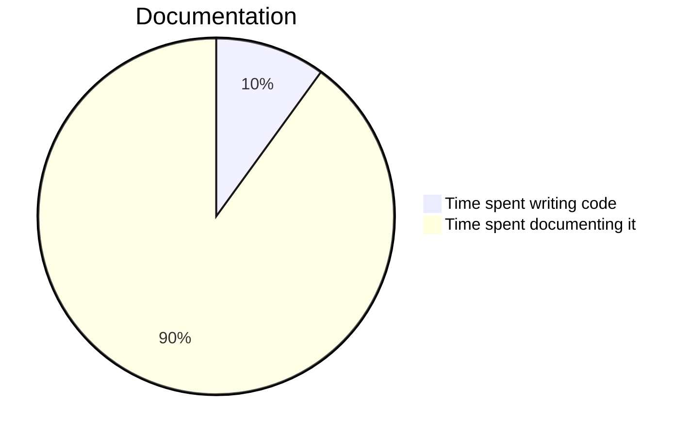

### **Vendors**

Here are examples of some popular vendors in this readme.

---

#### MermaidJS

MermaidJS for various graphs and schedules.

<br>



---

#### FlowchartJS

FlowchartJS for flowcharts.

<br>

```flowchart
st=>start: Start:>http://www.vivarado.com[blank]
e=>end:>http://www.vivarado.com
op1=>operation: My Operation
sub1=>subroutine: My Subroutine
cond=>condition: Yes
or No?:>http://www.vivarado.com
io=>inputoutput: catch something...
para=>parallel: parallel tasks
in=>input: some in
out=>output: some out

st->op1->cond
cond(yes)->io->e
cond(no)->para
para(path1, bottom)->sub1(right)->op1
para(path2, top)->op1
para(path3, right)->in->out->e
```
