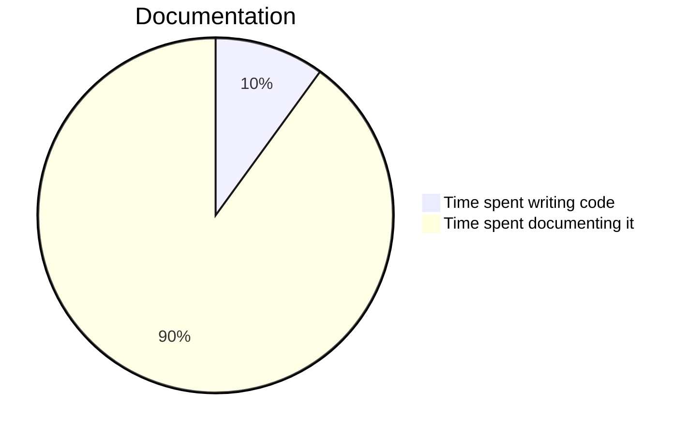

## **Πρόλογος**

**IncluDoc** είναι ένα έργο ανοιχτού κώδικα της **VivaRado**.

<div markdown='1' class="header_logo">


</div>

<div markdown='1' class="sidebar">

### **Περιεχόμενα**

1.  **Πρόλογος**
1.  **Εισαγωγή**
    1.  **Προφίλ**
    1.  **Επισκόπηση Εργου**
1.  **Σχεδιασμός**
1.  **Εγκατάσταση**
1.  **Χρήση**
    1.  **Παράμετροι**
    1.  **Συμπεριλήψεις**
    1.  **Αγνοήσεις**
1.  **Προμηθευτές**
1.  **Πρότυπα**
    1.  **Δομή**
    1.  **Πολυγλωσσία**

### Γλωσσάρι

1.  **Γλωσσάρι**

### Πηγές

1.  **Πηγές**

</div>
 
##  **Εισαγωγή**

**IncluDoc** συμπεριληπτικά και πολύγλωσσα έγγραφα Markdown!

#### Συνεισφέροντες:

*  VivaRado support@vivarado.com
*  Andreas Kalpakidis
*  Madina Akhmatova


---

### **Εισαγωγή / Προφίλ**


*  Εταιρεία: VivaRado LLP
*  Σχεδιαστής: Andreas Kalpakidis
*  Διαχειριστής: Madina Akhmatova

---


### **Εισαγωγή / Επισκόπηση Εργου**

*   Όνομα έργου: IncluDoc
*   Κωδικό Όνομα: IncDoc
*   Ημερομηνία πρότασης: 28/05/2025

---


### **Σχεδιασμός**

Tο IncluDoc συγκεντρώνει αρχεία Markdown, χειρίζεται δηλώσεις συμπερίληψης (include) και δημιουργεί ένα κύριο README.md ή/και ένα πολύγλωσσο README.html με επιφάνεια χρήστη.

Ένα αρχείο μπορεί να έχει εναλλακτικές και μπορείτε να επιλέξετε ποιά θα συμπεριληφθεί για σύνταξη.

Η επιφάνεια χρήστη και τα εισαγόμενα έγγραφα SVG έχουν σχεδιαστεί για να λειτουργούν με ```prefers-color-scheme: dark``` και αντιδρούν σε σκοτεινή και φωτεινή επιλογή.

---

### **Εγκατάσταση**

Προαπαιτούμενα:

* Η συλλογή των αρχείων **Markdown** βασίζεται στην **Python** τις βιβλιοθήκες **Markdown2** και **lxml**. 
* Η HTML επιφάνεια χρήστη εφαρμόζει **emphase** για να τονίσει τα στοιχεία του κώδικα, περιλαμβάνεται ήδη στο φάκελο ```assets/vendors```, ίσως χρειαστεί να συμπεριλάβετε κάποια αρχεία γλώσσας στο υποσέλιδο του ```Lib/html_template.py``` σε περίπτωση που χρειαστεί να προβάλετε περισσότερες γλώσσες.


#### Εγκαταστήστε τις Απαιτήσεις Python:

Για να εγκαταστήσετε τις απαιτήσεις python από το ```requirements.txt```, εκτελέστε αυτήν την εντολή:

```pip install -r Lib/requirements.txt```

ή εγκαταστήστε κάθε εξάρτηση αυτόνομα:

* lxml
* Markdown2


---

### **Χρήση**

Προετοιμάστε και οργανώστε τα αρχεία σας σε καταλόγους εντός ```/lang``` και μεταγλωττίστε με τις παρακάτω παραμέτρους.

---

### **Χρήση / Παράμετροι**


Περάστε τις παραμέτρους κατά την εκτέλεση του αρχείου python.

```
python3 './_README/gen_readme.py' --format 'html,md' --alter 'M0'
```

---

#### Επισκόπηση παραμέτρων

Περιγραφή κάθε παραμέτρου:

<br>

**--format** [ String ]
> 
> Δώστε την μορφή προς δημιουργεία σαν συμβολοσειρά, υποστηριζόμενες μορφές: ```'html'``` ```'md'``` 

<br>

**--alter** [ String ]
> 
> Παρέχετε τα εναλλακτικά αρχεία για συμπερίληψη, η προτεινόμενη δομή είναι ένα γράμμα και ένας αριθμός όπως ```A0, A1 ...```

---

### **Χρήση / Συμπεριλήψεις**


Μπορείτε να συμπεριλάβετε αρχεία MD μέσα από αρχεία MD παρέχοντας ένα **inline** MarkDown **code block** με ειδικές παραμέτρους. Οι τόνοι ` (Grave) εσωκλείονται (```) στα παραδείγματα που ακολουθούν, χρειαζόμαστε να εξωκλείθουν στον πραγματικό κώδικα markdown.

```
(```){include=partials/profile_project.md}(```)
```

Για εναλλακτική συμπερίλήψη:

```
(```){include=partials/profile_project.md,M0}(```)
```

Η προτεραιότητα εναλλακτικών αρχείων περιγράφεται εδώ: ```Templates / Structure```.

---

### **Χρήση / Αγνοήσεις**

Μπορείτε να δημιουργήσετε .gitignore και .npmignore για να αποφύγετε τη δημοσίευση άτακτων αρχείων markdown. Για παράδειγμα:

```
# .gitignore
_README/__pycache__/
_README/addons/
_README/lang/
_README/Lib/
_README/*.py
_README/*.txt
_README/version
_README/*.html
_README/*.sh
_README/assets/css/
_README/assets/js/
_README/assets/vendor/
```

---

### **Προμηθευτές**

Ορίστε παραδείγματα ορισμένων δημοφιλών προμηθευτών εντός αυτού του readme.

---

#### MermaidJS

MermaidJS για διάφορα γραφήματα και χρονοδιαγράμματα.

<br>



---

#### FlowchartJS

FlowchartJS για διαγράμματα ροής.

<br>

```flowchart
st=>start: Start:>http://www.vivarado.com[blank]
e=>end:>http://www.vivarado.com
op1=>operation: My Operation
sub1=>subroutine: My Subroutine
cond=>condition: Yes
or No?:>http://www.vivarado.com
io=>inputoutput: catch something...
para=>parallel: parallel tasks
in=>input: some in
out=>output: some out

st->op1->cond
cond(yes)->io->e
cond(no)->para
para(path1, bottom)->sub1(right)->op1
para(path2, top)->op1
para(path3, right)->in->out->e
```


---

### **Πρότυπα**

Η προτύπηση είναι ευέλικτη και εύκολη, επιτρέπει προσωποποιημένες δομές και συμπεριλήψεις. Ελπίζουμε να προσθέσουμε κάποια πρότυπα στο εγγύς μέλλον.

---

### **Πρότυπα / Δομή**

Είναι σημαντικό να διατηρήσετε μερικά πράγματα για να μπορείτε να χρησιμοποιήσετε το IncluDoc.


#### Hierarchy:

Η διαδραστική επιφάνεια χρήστη, χρησιμοποιεί τους τίτλους κατηγορίας H3, σε συνδυασμό με την ιεραρχία των περιεχομένων, για την πλοήγηση. Για αυτό θα πρέπει να ταιριάξετε αυτό που έχετε στο αρχείο περιεχομένων σας (που θα καταλήξει ως πλαϊνή μπάρα [sidebar]) και τους τίτλους των κεφαλίδων του αρχείου σας.

π.χ.:

Υποθέτοντας ότι αυτό είναι το **contents.md**:

```
1.  **Introduction**
    1.  **Profile**
    	1.  **Contributors**
    1.  **Project Overview**
```

Το **document.md** πρέπει να έχει αυτές τις κεφαλίδες:


```plaintext
**Introduction**

**Introduction / Profile**

**Introduction / Profile / Contributors**

**Introduction / Project Overview**
```

#### Προτεραιότητα:

Τα αρχεία σε κάθε κατάλογο γλώσσας μέσα ```/lang```, και όχι βαθύτερα. Περιλαμβάνονται με σειρά αρίθμησης.

```
000_preface
001_contents
002_document
003_footer
```

#### Εναλλακτικές:

Κατά τη διάρκεια της παραγωγής, μπορείτε να εισάγετε την εναλλακτική που προτιμάτε να συμπεριληφθεί, χρησιμοποιώντας την παράμετρο ```--a``` or ```--alter```. Αυτό θα επιτρέψει την επιλογή εναλλακτικών εκδόσεων αρχείων για παραγωγή. Η προτεραιότητα είναι η επιλογή του αρχείο που ζητήθηκε με την παράμετρο ```--alter```, εάν αυτό το αρχείο δεν υπάρχει, τότε επιλέγετε η βασική έκδοχη αυτού του αρχείου.

e.g.:

Υποθέτοντας η παράμετρος ```--alter``` είναι ```M1```, εδώ είναι το αποτέλεσμα στα αρχεία σας:

```
000_M1_preface:
	> θα επιλεγεί επειδή είναι η ζητούμενη εναλλακτική.

000_preface:
	> θα αγνοηθεί επειδή είναι η βάση και βρέθηκε η εναλλακτική.

001_M0_contents:
	> θα αγνοηθεί επειδή είναι μια διαφορετική εναλλακτική.

001_contents:
	> θα επιλεγεί επειδή είναι η βάση και η εναλλακτική που ζητήθηκε δεν βρέθηκε.
```

---

### **Πρότυπα / Πολυγλωσσία**

Δημιουργήστε πολύγλωσσα έγγραφα, με επιφάνεια χρήστη.


#### Πολύγλωσσοι Κατάλογοι:

Το IncluDoc θα συγκεντρώσει κάθε κατάλογο γλωσσών που περιέχετε εντός του ```/lang``` θα τους συγκεντρώσει και θα τους συνδυάσει σε ξεχωριστά έγγραφα MD, θα τοποθετηθούν εντός των καταλόγων ως ```README_collected_{lang}.md```.

Η έκδοση HTML των εγγράφων μετά τη δημιουργία θα εμφανιστεί σαν ```_README/README.html``` με επιφάνεια χρήστη για εναλλαγή μεταξύ των γλωσσών


---


### **Γλωσσάρι**

N/A


---


### **Πηγές**

[**Markdown2**](https://pypi.org/project/markdown2/)<br>
[**lxml**](https://pypi.org/project/lxml/)<br>
[**MermaidJS**](https://mermaid.js.org/)<br>
[**FlowchartJS**](https://flowchart.js.org/?lng=en)<br>

---

